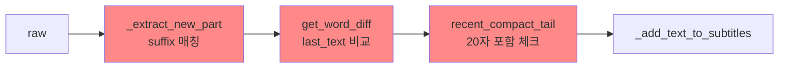

# 🔍 자막 수집 알고리즘 잠재적 문제점 분석

> **분석 일자**: 2026-02-12
> **분석 대상**: v16.12 글로벌 히스토리 + Suffix 매칭 파이프라인
> **참조 문서**: `PIPELINE_LOCK.md`, `CLAUDE.md`, `README.md`
> **분석 관점**: 자막 수집 **정확성** 중심

---

## 1. 알고리즘 구조 요약

```text
Worker(Observer + 폴링 하이브리드)
  → selector 후보 우선순위 정렬 (.smi_word:last-child 우선)
  → 기본 문서 + iframe/frame 순회
  → Observer 주입 우선, 실패 시 JS 폴링 브리지(180ms)
  → 메인 루프(0.2초): Observer 버퍼 우선, 미수집 시 폴링 fallback
  → compact 기준 중복 전송 억제
  → Queue(preview)
  → _prepare_preview_raw (정규화, 게이트, fallback)
  → _process_raw_text (GlobalHistory + Suffix 코어)
  → 후단 정제 (get_word_diff, recent compact tail)
  → _add_text_to_subtitles
  → 종료 시 _drain_pending_previews
```

코어 알고리즘은 `_confirmed_compact`(확정된 모든 텍스트, 공백제거)와 `_trailing_suffix`(마지막 50자)를 유지하면서, 새 raw에서 suffix 이후의 새 부분만 추출하는 방식입니다.

---

## 2. 잠재적 문제점 분석

### 2.1 🟡 Suffix 충돌(Collision) — 정확성 위험도: **중간 (완화됨)**

**문제**: `_trailing_suffix`는 50자 고정 길이입니다. 국회 회의에서는 반복적인 형식 표현이 많습니다 (예: "위원장 ○○○", "의원 ○○○", "그렇습니다", "네 알겠습니다" 등). 이런 짧은 반복 패턴이 50자 suffix 내에서 충돌할 가능성이 있습니다.

**코드 위치**: `_extract_new_part`
```python
pos = raw_compact.rfind(self._trailing_suffix)
```

**시나리오**:
1. 발언자 A: "...위원장님 감사합니다"
2. 발언자 B: (다른 맥락에서) "...위원장님 감사합니다 추가 발언..."
3. `rfind()`는 **마지막** 발견 위치를 기준으로 suffix 이후만 추출

**영향**: 중복 텍스트가 누적되거나, 잘못된 위치에서 슬라이싱하여 텍스트 일부가 중복/누락됩니다.

> [!NOTE]
> 본 항목의 핵심 이슈(`find` 기반 과잉 추출)는 현재 코드에서 `rfind`로 전환되어 완화되었습니다.
> 잔여 위험은 고정 50자 suffix의 충돌 가능성(반복 구문 과밀 구간)입니다.

---

### 2.2 🟡 Resync/Reset 시 중복 유입 — 정확성 위험도: **중간 (완화됨)**

**현행**:
- desync/ambiguous 임계값 초과 시 `_soft_resync()`로 최근 확정 자막 기반 복원
- `subtitle_reset`(자막 클리어 감지) 시에만 완전 리셋 적용

**코드 위치**: `_prepare_preview_raw`, `subtitle_reset` 핸들러
```python
# desync/ambiguous
self._soft_resync()

# subtitle_reset
self._confirmed_compact = ""
self._trailing_suffix = ""
```

**시나리오**:
1. 네트워크 지연이나 DOM 변동으로 10회 연속 desync 발생
2. 히스토리가 최근 자막 기준으로 복원됨 (대부분 케이스)
3. 리셋 직후 들어오는 raw에는 **이미 수집한 텍스트**가 포함되어 있을 가능성이 높음
4. 발언자 전환(`subtitle_reset`) 시에는 의도적으로 전체 문맥을 초기화

**영향**: 과거 대비 대량 중복 위험은 크게 감소했지만, 네트워크 급변 구간에서 짧은 중복 조각은 여전히 발생할 수 있습니다.

> [!IMPORTANT]
> 완전 리셋은 `subtitle_reset`에 한정되며, 이는 자막 영역 클리어가 확인된 발언자 전환 상황을 전제로 합니다.

---

### 2.3 🟡 compact 함수의 정보 손실 — 정확성 위험도: **중간**

**문제**: `compact_subtitle_text`는 **모든 공백을 제거**합니다. 이는 매칭 성능을 높이지만, 동음이의어나 의미가 달라지는 경우에 false positive를 유발할 수 있습니다.

**코드 위치**: `utils.compact_subtitle_text` (L36-41)
```python
def compact_subtitle_text(text: str) -> str:
    text = Config.RE_ZERO_WIDTH.sub('', text)
    return Config.RE_MULTI_SPACE.sub('', text).strip()
```

**시나리오**:
- "경제 성장률" → compact: "경제성장률"
- "경제성 장률" (오인식) → compact: "경제성장률"
- 두 텍스트가 compact 기준 동일해져서 **새 텍스트를 중복으로 잘못 차단**

**영향**: 실제로는 AI 인식 오류로 약간 다른 텍스트인데 compact 결과가 동일해서 누락되는 케이스. 단, 한국어 특성상 이 경우는 드뭅니다.

---

### 2.4 🟡 0.2초 폴링 간격의 한계 — 정확성 위험도: **중간 (하이브리드로 완화됨)**

**문제**: Worker 메인 루프는 0.2초 주기이며, 폴링만 사용할 경우 빠른 전환에서 중간 상태를 놓칠 수 있습니다.

**코드 위치**: `_extraction_worker`, `_inject_mutation_observer`, `_collect_observer_changes`
```python
if now - last_check >= 0.2:
```

**시나리오**:
1. 발언자 A의 마지막 문장이 DOM에 0.1초간 표시
2. 발언자 B의 첫 문장으로 DOM이 교체
3. 0.2초 폴링 주기로 인해 A의 마지막 문장을 캡처하지 못함

**현행 완화**:
- Observer 버퍼 수집 우선
- 타겟 미탐색 시 JS 폴링 브리지(180ms) fallback
- Observer 비활성 시 폴링 fallback 자동 전환

> [!NOTE]
> 해당 하이브리드는 이미 도입되어 있으며, 잔여 위험은 "프레임 구조 급변 + 선택자 미적중" 동시 발생 구간입니다.

---

### 2.5 🟡 `get_word_diff` 다단계 매칭의 과잉 정제 — 정확성 위험도: **중간**

**문제**: `get_word_diff`는 7단계(startswith → rfind → word overlap → compact rfind → suffix 매칭 → sliding window → reverse window)의 복잡한 매칭 파이프라인입니다. 여러 경로 중 하나라도 false positive를 내면 유효한 새 텍스트가 잘립니다.

**코드 위치**: `utils.get_word_diff` (L203-316)

**시나리오**:
1. last_text: "예산안 검토 결과 보고를 하겠습니다"
2. new_part (코어에서 추출됨): "보고를 하겠습니다 다음은 세입 세출"
3. `get_word_diff`의 suffix 매칭 단계에서 "보고를하겠습니다"가 매칭됨
4. "다음은 세입 세출"만 반환됨 → 정상 동작이지만,
5. 만약 compact 기준 suffix가 new_part **전체**를 소비하면 빈 문자열 반환 → **누락 발생**

**영향**: 코어 알고리즘이 올바르게 추출한 결과를 후단 정제가 과도하게 필터링하여 유효 텍스트가 누락될 위험이 있습니다.

---

### 2.6 🟡 `_add_text_to_subtitles` 병합 조건의 모호성 — 정확성 위험도: **중간**

**문제**: 마지막 엔트리에 이어붙일지 새 엔트리를 만들지를 "5초 이내 && 300자 미만"으로 결정합니다. 이 기준이 발언자 전환과 상관없이 시간/길이만으로 판단합니다.

**코드 위치**: `_add_text_to_subtitles` (L3209-3215)
```python
if elapsed < 5.0 and len(last_entry.text) + len(text) < 300:
    can_append = True
```

**시나리오**:
- 발언자 A: "동의합니다" (2초 전)
- 발언자 B: "의장님"
- elapsed < 5.0이고 길이 < 300이므로 **다른 발언자의 텍스트가 같은 엔트리에 병합됨**

**영향**: 타임스탬프의 정확성이 떨어지고, 발언자 구분이 불가능해집니다. SRT/VTT 출력물의 품질 저하로 이어집니다.

---

### 2.7 🟢 종료 시 `_drain_pending_previews` 강제 플러시 — 정확성 위험도: **낮음**

**문제**: 종료 직전 `_prepare_preview_raw`가 None을 반환하면, 방어 코드로 raw를 강제 통과시킵니다. 이 경로는 코어의 게이트를 우회합니다.

**코드 위치**: `_drain_pending_previews` (L2810-2812)
```python
elif data:
    forced = utils.clean_text_display(str(data)).strip()
    if forced:
        self._process_raw_text(forced)
```

**영향**: 종료 직전 대량 중복이 유입될 수 있으나, 코어 알고리즘의 suffix 매칭이 여전히 작동하므로 실질적 위험은 낮습니다.

---

### 2.8 🟢 `_confirmed_compact` 무한 성장 — 정확성 위험도: **낮음** (메모리 위험도: **중간**)

**문제**: `_confirmed_compact`는 세션 시작부터 종료까지 모든 확정 텍스트를 누적합니다. 5시간 회의 기준 약 50,000~100,000자가 될 수 있습니다.

**코드 위치**: `_process_raw_text` (L3150)
```python
self._confirmed_compact += new_compact
```

**영향**: 메모리 사용량 증가는 미미하지만(~100KB), `recent_compact_tail` 검색 시 `new_compact in recent_compact_tail` 연산은 O(n*m) 복잡도로 장시간 세션에서 성능 영향이 있을 수 있습니다. 다만 `max_compact_len=5000` 제한이 있어 실용적 문제는 적습니다.

---

## 3. 유사 프로그램 비교 분석

### 3.1 Chrome 확장 프로그램: "Assembly Webcast Subtitle Saver" (국회 AI 자막 저장기)

| 항목 | 본 프로그램 (Selenium) | Chrome 확장 프로그램 |
|------|----------------------|---------------------|
| **DOM 감지 방식** | 0.2초 폴링 (`find_element`) | `MutationObserver` (이벤트 기반) |
| **캡처 누락 가능성** | 빠른 전환 시 누락 가능 | 이론상 0% (모든 변경 감지) |
| **중복 처리** | 글로벌 히스토리 + Suffix | 단순 이전값 비교 (추정) |
| **복잡도** | 매우 높음 (7단계 파이프라인) | 낮음 (DOM 직접 접근) |
| **환경 독립성** | 독립 실행 파일 가능 | Chrome 필수 |
| **저장 형식** | TXT/SRT/VTT/DOCX/HWP/RTF/DB | TXT |

**핵심 차이**: Chrome 확장은 DOM에 직접 접근하므로 중간 상태 누락이 없고, 별도의 deduplication 알고리즘이 단순합니다. 반면 본 프로그램은 Selenium을 통한 간접 접근이므로 폴링 기반의 복잡한 파이프라인이 필수적입니다.

### 3.2 학술적 관점: Subtitle Edit Rate (SubER)

자막 정확성 평가의 업계 표준인 **SubER 메트릭**에 따르면:
- **99% 이상**: 업계 표준 (VOD)
- **96~97%**: 자동 라이브 캡션 평균
- **95%**: 약 2.5문장마다 1개 오류

본 프로그램의 정확성 손실 원인은 AI 음성인식 자체의 오류가 아니라, **추출 파이프라인에서의 누락/중복**입니다. 이는 SubER 기준과는 별도의 영역입니다.

---

## 4. 정확성 위험 요약표

| # | 문제 | 위험도 | 현상 | 현재 완화 수단 |
|---|------|--------|------|---------------|
| 2.1 | Suffix 충돌 | 🟡 중간 | 반복 구간 중복 가능성 | `rfind` + ambiguous suffix 게이트 |
| 2.2 | Resync/Reset 중복 | 🟡 중간 | 짧은 중복 조각 가능 | `_soft_resync` + `subtitle_reset` 분리 정책 |
| 2.3 | compact 정보 손실 | 🟡 중간 | 미세 누락 | 한국어 특성상 드묾 |
| 2.4 | 폴링 간격 한계 | 🟡 중간 | 프레임 급변 시 일시 누락 | Observer + 폴링 브리지 하이브리드 |
| 2.5 | 후단 과잉 정제 | 🟡 중간 | 유효 텍스트 누락 | 3자 미만 필터로 최소화 |
| 2.6 | 병합 조건 모호성 | 🟡 중간 | 발언자 혼합 | — |
| 2.7 | 종료 강제 플러시 | 🟢 낮음 | 종료 시 중복 | 코어 suffix 매칭 |
| 2.8 | 히스토리 무한 성장 | 🟢 낮음 | 장시간 성능 | max_compact_len 제한 |

---

## 5. 개선 제안 (허용 조정 영역 내)

> [!NOTE]
> 아래 제안은 모두 **PIPELINE_LOCK.md의 허용 조정 영역**(게이트 임계값, fallback 조건, 종료 플러시, Worker 전처리) 내에서의 조정입니다. 코어 알고리즘(`_process_raw_text`, `_extract_new_part`)은 수정하지 않습니다.

### 5.1 Resync 후 부분 복원 (§2.2 완화) — **적용 완료**
`_prepare_preview_raw`의 desync/ambiguous 경로는 `_soft_resync()`를 사용해 최근 확정 자막 기반으로 히스토리를 복원합니다.
```python
with self.subtitle_lock:
    tail = " ".join(e.text for e in self.subtitles[-5:])
self._confirmed_compact = compact_subtitle_text(tail)
self._trailing_suffix = self._confirmed_compact[-50:]
```

### 5.2 MutationObserver 하이브리드 (§2.4 완화) — **적용 완료**
현행 구현은 Observer 우선 수집 + 폴링 fallback + 타겟 미탐색 시 폴링 브리지(`allow_poll_fallback`)를 사용합니다.
```python
# 1) _inject_mutation_observer(..., allow_poll_fallback=False)
# 2) 실패 시 _inject_mutation_observer(..., allow_poll_fallback=True)
# 3) _collect_observer_changes(...) 우선, 미수집 시 DOM 폴링 fallback
```

### 5.3 발언자 전환 감지 힌트 (§2.6 완화)
AI 자막에 발언자 전환 패턴(예: "○○○ 위원", "위원장" 등)이 나타나면 강제로 새 엔트리를 생성:
```python
SPEAKER_PATTERN = re.compile(r'(위원장|의원|위원|장관|차관)\s')
if SPEAKER_PATTERN.search(text[:20]):
    can_append = False  # 발언자 전환으로 새 엔트리 강제 생성
```

---

## 6. 결론

현재 글로벌 히스토리 + Suffix 알고리즘은 DOM 루핑에 대한 면역성이 검증된 구조이며, §5.1/§5.2 제안은 현행 코드에 반영된 상태입니다.
잔여 과제는 코어 변경이 아닌 주변 레이어 튜닝(선택자/프레임 적중률, 게이트 임계값, 병합 정책 정밀화)입니다.

정확성 관점에서 가장 큰 위험은 **"중복"** 방향이며, **"누락"** 방향의 위험은 상대적으로 잘 관리되고 있습니다. 다만 후단 정제(`get_word_diff`)가 지나치게 공격적으로 필터링하는 경우의 미세 누락은 운영 로그 분석을 통해 지속적으로 관찰할 필요가 있습니다.

---
---

# Part 2: 코어 알고리즘 직접 개선안 (구조 고정 해제 전제)

> [!CAUTION]
> 아래 내용은 **PIPELINE_LOCK.md의 코어 고정 규칙을 해제**한다는 전제 하에 작성된 분석입니다.
> `_process_raw_text`, `_extract_new_part`의 핵심 의미론을 직접 변경하는 제안을 포함합니다.
> 적용 시 반드시 **충분한 테스트**와 **기존 DOM 루핑 면역성 검증**이 필요합니다.
>
> [!NOTE]
> `7.1 find → rfind` 항목은 현행 코드에 이미 반영되었습니다. Part 2는 나머지 대안(적응형 suffix, 히스토리 구조 전환 등) 검토용 아카이브입니다.

---

## 7. 코어 취약점 근본 원인 분석

### 7.1 `find()` vs `rfind()` — 가장 즉각적인 개선점

**현재 코드** (`_extract_new_part` L3177):
```python
pos = raw_compact.find(self._trailing_suffix)
```

**문제**: `find()`는 **첫 번째** 매칭 위치를 반환합니다. suffix가 raw 내에 여러 번 나타나면:

```
raw_compact: "위원장감사합니다다음안건은위원장감사합니다추가발언시작"
suffix:      "위원장감사합니다"
             ↑ find() = 0        ↑ rfind() = 16
```

- `find()` → pos=0 → "다음안건은위원장감사합니다추가발언시작" (과잉 추출, 중복 포함)
- `rfind()` → pos=16 → "추가발언시작" (정확한 새 부분만 추출)

```python
# 개선안 A: 단순 rfind 전환
def _extract_new_part(self, raw: str, raw_compact: str) -> str:
    if not self._trailing_suffix:
        return raw

    # ✅ rfind로 마지막 위치의 suffix 이후만 추출
    pos = raw_compact.rfind(self._trailing_suffix)

    if pos >= 0:
        start_idx = pos + len(self._trailing_suffix)
        if start_idx >= len(raw_compact):
            return ""
        return utils.slice_from_compact_index(raw, start_idx)

    return raw
```

> [!WARNING]
> **`rfind()` 전환의 위험**: DOM 루핑 시 suffix가 raw 끝부분에 반복되면 `rfind()`는 마지막 위치를 잡아 **새 텍스트를 놓칠 수 있습니다**. 예:
> ```
> raw: "A B C D E A B C D E F G"
> suffix: "ABCDE"
> rfind → pos=뒤쪽 → 추출: "FG" ← 정확
> ```
> 하지만 루핑이 *내용 없이* 반복만 된다면:
> ```
> raw: "A B C D E A B C D E"
> suffix: "ABCDE"
> rfind → pos=뒤쪽 → 추출: "" ← 정확 (새 내용 없으므로)
> ```
> 단순 `rfind()` 전환은 대부분의 경우 안전하지만, **suffix 자체가 반복 구간의 일부일 때** edge case가 있을 수 있습니다.

**결론**: `find()` → `rfind()` 전환은 **투자 대비 효과가 가장 높은 단일 변경**입니다.

---

### 7.2 고정 길이 Suffix의 한계와 적응형 Suffix

**현재**: `_suffix_length = 50` 고정

**문제점**:
- **50자가 너무 짧은 경우**: 반복적인 형식 표현("위원장 ○○○ 감사합니다")이 50자 내에 중복 출현 → suffix 충돌
- **50자가 너무 긴 경우**: AI 인식 오류로 한두 글자가 변경되면 suffix 전체가 매칭 실패 → desync

```python
# 개선안 B: 적응형 듀얼 Suffix
class AdaptiveSuffix:
    """짧은 suffix와 긴 suffix를 동시에 유지하여 정밀도와 안정성을 모두 확보"""

    def __init__(self, short_len: int = 30, long_len: int = 80):
        self.short_len = short_len
        self.long_len = long_len
        self.short_suffix = ""
        self.long_suffix = ""

    def update(self, confirmed_compact: str):
        self.short_suffix = confirmed_compact[-self.short_len:] if len(confirmed_compact) >= self.short_len else confirmed_compact
        self.long_suffix = confirmed_compact[-self.long_len:] if len(confirmed_compact) >= self.long_len else confirmed_compact

    def find_in(self, raw_compact: str) -> int:
        """긴 suffix 우선 매칭 → 짧은 suffix fallback"""
        # 1. 긴 suffix로 정밀 매칭 (충돌 확률 극히 낮음)
        if self.long_suffix:
            pos = raw_compact.rfind(self.long_suffix)
            if pos >= 0:
                return pos + len(self.long_suffix)

        # 2. 긴 suffix 실패 → 짧은 suffix로 fallback (AI 인식 오류 대응)
        if self.short_suffix:
            pos = raw_compact.rfind(self.short_suffix)
            if pos >= 0:
                return pos + len(self.short_suffix)

        return -1  # 매칭 실패
```

**장점**: 긴 suffix(80자)는 충돌 확률을 극적으로 낮추고, 짧은 suffix(30자)는 AI 인식 변동에 대한 fallback을 제공합니다.

---

### 7.3 선형 문자열 히스토리의 근본적 대안 — 해시 기반 블록 히스토리

**현재 구조**:
```
_confirmed_compact: "확정된모든텍스트를연결한하나의긴문자열..."  (무한 성장)
_trailing_suffix:   "...긴문자열의마지막50자"
```

**대안: 해시 기반 블록 히스토리**

기존의 단일 문자열 누적 대신, 확정된 텍스트를 **N자 블록 단위로 해싱**하여 저장합니다. 새 raw에서 이미 확정된 블록을 빠르게 스킵합니다.

```python
import hashlib
from collections import OrderedDict

class BlockHashHistory:
    """확정된 텍스트를 블록 단위로 해싱하여 O(1) 중복 검출"""

    def __init__(self, block_size: int = 40):
        self.block_size = block_size
        self.seen_hashes: OrderedDict[str, int] = OrderedDict()  # hash → 순서
        self.trailing_suffix = ""
        self._counter = 0

    def _hash(self, text: str) -> str:
        return hashlib.md5(text.encode()).hexdigest()[:12]

    def add_confirmed(self, compact_text: str):
        """확정된 텍스트를 블록으로 나누어 해시 저장"""
        for i in range(0, len(compact_text), self.block_size):
            block = compact_text[i:i + self.block_size]
            if len(block) >= self.block_size // 2:  # 최소 반 블록 이상
                h = self._hash(block)
                self.seen_hashes[h] = self._counter
                self._counter += 1

        # suffix도 갱신
        self.trailing_suffix = compact_text[-50:] if len(compact_text) >= 50 else compact_text

        # 메모리 제한 (최근 5000 블록만 유지)
        while len(self.seen_hashes) > 5000:
            self.seen_hashes.popitem(last=False)

    def find_new_start(self, raw_compact: str) -> int:
        """raw_compact에서 이미 확정된 블록을 건너뛴 시작 위치 반환"""
        # 1. 기존 suffix 매칭 (빠른 경로)
        if self.trailing_suffix:
            pos = raw_compact.rfind(self.trailing_suffix)
            if pos >= 0:
                return pos + len(self.trailing_suffix)

        # 2. 블록 해시 스캔 (뒤에서부터)
        best_end = 0
        for i in range(len(raw_compact) - self.block_size, -1, -self.block_size):
            block = raw_compact[i:i + self.block_size]
            h = self._hash(block)
            if h in self.seen_hashes:
                candidate = i + self.block_size
                if candidate > best_end:
                    best_end = candidate

        return best_end  # 0이면 전체가 새 텍스트
```

**장점**:
- `_confirmed_compact`의 무한 성장 문제 해결 (해시만 저장, O(1) 조회)
- suffix 충돌 문제 해결 (블록 단위 확인으로 false positive 확률 감소)

**단점**:
- 해시 충돌 가능성 (MD5 12자 = 48비트 → 실용적으로 무시 가능)
- suffix 기반보다 구현 복잡도 증가
- DOM 루핑 대응 검증 필요

---

### 7.4 `_process_raw_text`의 구조적 재설계

현재 구조는 **"새 부분 추출 → 후단 정제"** 2단계인데, 이 과정에서 코어와 후단이 **서로 다른 기준**으로 동일한 작업(중복 판별)을 수행합니다.



**문제**: 3개의 독립적인 중복 검출 레이어가 각각 다른 기준으로 작동하여, 하나가 통과시킨 것을 다른 하나가 다시 차단하거나, 모두 통과시키지만 여전히 중복인 경우가 발생합니다.

```python
# 개선안 C: 통합 중복 판별 파이프라인
def _process_raw_text_v2(self, raw: str):
    """중복 판별을 단일 분기로 통합"""
    if not raw:
        return
    raw = raw.strip()
    if raw == self._last_raw_text:
        return
    self._last_raw_text = raw

    raw_compact = utils.compact_subtitle_text(raw)
    if not raw_compact:
        return

    # ── 1단계: suffix 기반 새 부분 추출 ──
    new_start = self._history.find_new_start(raw_compact)  # 해시 기반 또는 suffix 기반

    if new_start >= len(raw_compact):
        return  # 모든 내용이 이미 확정됨

    if new_start > 0:
        new_part = utils.slice_from_compact_index(raw, new_start).strip()
    else:
        # suffix를 찾지 못한 경우: 전체가 새 텍스트?
        # 직접 확정 자막과 비교하여 판단
        new_part = raw

    if not new_part or len(new_part) < 3:
        return

    # ── 2단계: 통합 중복 검증 (단일 함수) ──
    new_compact = utils.compact_subtitle_text(new_part)
    if self._is_duplicate(new_compact):
        return

    # ── 3단계: 확정 ──
    self._history.add_confirmed(new_compact)
    self._add_text_to_subtitles(new_part)

def _is_duplicate(self, new_compact: str) -> bool:
    """단일 함수로 모든 중복 조건을 검사"""
    if len(new_compact) < 3:
        return True

    # 최근 자막과 완전 포함 관계
    with self.subtitle_lock:
        if self.subtitles:
            last_compact = utils.compact_subtitle_text(self.subtitles[-1].text)
            if new_compact in last_compact:
                return True

    # 최근 N개 자막의 compact tail에 포함 (20자 이상만)
    if len(new_compact) >= 20:
        tail = self._confirmed_history_compact_tail(max_entries=12, max_compact_len=5000)
        if tail and new_compact in tail:
            return True

    return False
```

**장점**:
- 중복 검출 로직이 하나의 함수로 통합되어 **예측 가능성 향상**
- `get_word_diff`의 7단계 매칭 파이프라인에 의한 과잉 정제 제거
- 코드 복잡도 대폭 감소

**주의**: `get_word_diff`는 코어의 후단 정제로 사용되지만, **코어 자체의 suffix 매칭이 `rfind`로 개선되면** 그 역할의 상당 부분이 불필요해집니다.

---

## 8. Worker 레이어 근본 개선

### 8.1 MutationObserver + 폴링 하이브리드 아키텍처

현재 0.2초 폴링의 한계를 MutationObserver로 보완하되, 안정성을 위해 폴링도 유지합니다.

```python
def _extraction_worker(self, url, selector, headless):
    # ... (기존 드라이버 초기화 코드) ...

    # ── MutationObserver 주입 ──
    observer_script = f"""
    (function() {{
        window.__subtitleBuffer = [];
        window.__subtitleLastText = '';
        const target = document.querySelector('{selector}');
        if (!target) return false;

        const observer = new MutationObserver(function() {{
            const text = target.innerText || target.textContent || '';
            if (text && text !== window.__subtitleLastText) {{
                window.__subtitleLastText = text;
                window.__subtitleBuffer.push({{
                    text: text,
                    ts: Date.now()
                }});
                // 버퍼 크기 제한
                if (window.__subtitleBuffer.length > 100) {{
                    window.__subtitleBuffer = window.__subtitleBuffer.slice(-50);
                }}
            }}
        }});

        observer.observe(target, {{
            childList: true,
            subtree: true,
            characterData: true
        }});
        return true;
    }})();
    """
    observer_ok = driver.execute_script(observer_script)
    logger.info("MutationObserver 주입: %s", "성공" if observer_ok else "실패")

    # ── 메인 루프: Observer 버퍼 우선 + 폴링 fallback ──
    while not self.stop_event.is_set():
        try:
            now = time.time()

            if now - last_check >= 0.2:
                # 1. Observer 버퍼에서 수집 (이벤트 기반, 누락 없음)
                try:
                    changes = driver.execute_script(
                        "const buf = window.__subtitleBuffer || [];"
                        "window.__subtitleBuffer = [];"
                        "return buf;"
                    )
                except Exception:
                    changes = []

                if changes:
                    for change in changes:
                        text = utils.clean_text_display(change.get("text", ""))
                        text_compact = utils.compact_subtitle_text(text)
                        if text and text_compact and text_compact != worker_last_raw_compact:
                            worker_last_raw_compact = text_compact
                            self.message_queue.put(("preview", text))
                else:
                    # 2. Observer가 작동하지 않으면 기존 폴링 fallback
                    try:
                        text = driver.find_element(By.CSS_SELECTOR, selector).text.strip()
                        text = utils.clean_text_display(text)
                        text_compact = utils.compact_subtitle_text(text)
                        if text and text_compact and text_compact != worker_last_raw_compact:
                            worker_last_raw_compact = text_compact
                            self.message_queue.put(("preview", text))
                    except Exception:
                        pass

                last_check = now

            self.stop_event.wait(timeout=0.05)
        except Exception as e:
            # ... (기존 재연결 로직) ...
```

**핵심 차이점**:
- Observer가 **0.2초 사이에 발생한 모든 변경**을 버퍼에 기록
- 폴링 주기에 버퍼를 비우면서 모든 중간 상태를 캡처
- Observer 실패 시 기존 폴링으로 자연스럽게 fallback

---

## 9. 게이트 레이어 재설계

### 9.1 Resync 시 "소프트 리셋"

**현재**: `_confirmed_compact = ""`로 전체 리셋 → 대량 중복 위험

```python
# 개선안 D: 최근 자막 기반 소프트 리셋
def _soft_resync(self):
    """전체 리셋 대신, 최근 확정 자막에서 히스토리를 재구성"""
    with self.subtitle_lock:
        if self.subtitles:
            # 최근 5개 자막의 compact로 히스토리 재구성
            recent = " ".join(e.text for e in self.subtitles[-5:] if e and e.text)
            self._confirmed_compact = utils.compact_subtitle_text(recent)
            if len(self._confirmed_compact) >= self._suffix_length:
                self._trailing_suffix = self._confirmed_compact[-self._suffix_length:]
            else:
                self._trailing_suffix = self._confirmed_compact
            logger.info("소프트 리셋: suffix=%s", self._trailing_suffix[-20:])
        else:
            # 자막이 없으면 어쩔 수 없이 전체 리셋
            self._confirmed_compact = ""
            self._trailing_suffix = ""
```

**효과**: 리셋 후에도 최근 자막의 맥락이 유지되어, 동일 텍스트가 다시 들어왔을 때 중복으로 정확히 차단됩니다.

---

### 9.2 `_prepare_preview_raw`의 ambiguous 처리 개선

**현재**: suffix가 raw에 2회 이상 나타나면 `first_pos`와 `last_pos`를 비교하여 판단, 하지만 연산이 `rfind`와 `find`로 분리되어 있어 비효율적입니다.

```python
# 개선안 E: 모든 suffix 출현 위치를 수집하여 최적 위치 결정
def _find_best_suffix_position(self, raw_compact: str, suffix: str) -> int:
    """suffix가 raw에 여러 번 나타날 때, 가장 적절한 위치를 선택"""
    positions = []
    start = 0
    while True:
        pos = raw_compact.find(suffix, start)
        if pos < 0:
            break
        positions.append(pos)
        start = pos + 1

    if not positions:
        return -1
    if len(positions) == 1:
        return positions[0]

    # 여러 위치 중 "새 텍스트 양이 가장 적은" 위치 선택
    # (가장 뒤쪽 = 가장 적은 새 텍스트 = 가장 안전)
    return positions[-1]
```

---

## 10. 코어 개선 적용 우선순위

| 순위 | 개선안 | 난이도 | 효과 | 위험도 |
|------|--------|--------|------|--------|
| **1** | `find()` → `rfind()` 전환 (§7.1) | 🟢 1줄 변경 | 🔴 높음 | 🟢 낮음 |
| **2** | 소프트 리셋 (§9.1) | 🟡 ~15줄 | 🔴 높음 | 🟢 낮음 |
| **3** | 적응형 듀얼 Suffix (§7.2) | 🟡 ~30줄 | 🟡 중간 | 🟡 중간 |
| **4** | MutationObserver 하이브리드 (§8.1) | 🔴 ~50줄 | 🟡 중간 | 🟡 중간 |
| **5** | 통합 중복 판별 (§7.4) | 🔴 리팩터링 | 🟡 중간 | 🔴 높음 |
| **6** | 해시 기반 블록 히스토리 (§7.3) | 🔴 ~80줄 | 🟢 낮음 | 🔴 높음 |

> [!TIP]
> **추천 적용 순서**: 1번(`rfind`) → 2번(소프트 리셋) 만으로도 이전 분석의 🔴 고위험 문제 2개를 모두 해결할 수 있습니다. 3번 이후는 추가적인 정밀도 향상이 필요할 때 적용하세요.

---

## 11. 변경 후 검증 전략

코어 알고리즘을 변경했다면 아래 체크리스트를 반드시 수행해야 합니다.

### 11.1 회귀 테스트 시나리오

| 시나리오 | 기대 결과 | 검증 방법 |
|---------|----------|----------|
| DOM 루핑 (동일 텍스트 반복) | 중복 0건 | 테스트 스크립트로 동일 raw 반복 전송 |
| 빠른 발언자 전환 | 누락 0건 | raw를 0.1초 간격으로 완전히 다른 텍스트로 교체 |
| AI 인식 약간 변경 | 누락 0건, 중복 0건 | "입장을" → "입장 을" 등 공백 변동 raw 전송 |
| 장시간 연속 수집 (5시간) | 메모리 안정 | 반복 raw를 10,000회 전송 후 메모리 확인 |
| 네트워크 끊김 후 복구 | 중복 최소 | 5초 공백 후 이전 raw 포함한 새 raw 전송 |
| suffix 충돌 (반복 형식어) | 중복 0건 | "위원장 감사합니다" 포함 raw 다수 전송 |

### 11.2 자동화 가능한 단위 테스트

```python
# test_core_algorithm.py (예시)
def test_rfind_prevents_over_extraction():
    """rfind 전환 후 suffix 중복 시 과잉 추출 방지"""
    mw = MockMainWindow()
    mw._trailing_suffix = "위원장감사합니다"
    raw = "기존텍스트위원장감사합니다중간텍스트위원장감사합니다새로운발언"
    raw_compact = compact_subtitle_text(raw)
    result = mw._extract_new_part(raw, raw_compact)
    assert "새로운발언" in compact_subtitle_text(result)
    assert "중간텍스트" not in compact_subtitle_text(result)

def test_soft_resync_prevents_mass_duplicate():
    """소프트 리셋 후 이전 텍스트 재유입 시 중복 차단"""
    mw = MockMainWindow()
    mw.subtitles = [SubtitleEntry("이전에 확정된 자막입니다")]
    mw._soft_resync()
    # 동일 텍스트가 다시 들어오면 차단되어야 함
    mw._process_raw_text("이전에 확정된 자막입니다")
    assert len(mw.subtitles) == 1  # 추가되지 않아야 함
```

---

## 12. 최종 결론

코어 알고리즘의 **글로벌 히스토리 + Suffix 매칭** 철학은 견고하며, DOM 루핑에 대한 면역성이 검증되어 있습니다. 코어를 수정한다면:

1. **최소 변경**: `find()` → `rfind()`(1줄) + 소프트 리셋(15줄)으로 가장 큰 두 가지 정확성 위험을 해결
2. **중간 변경**: 적응형 듀얼 Suffix + MutationObserver로 폴링 한계와 suffix 충돌을 구조적으로 해소
3. **대규모 변경**: 해시 기반 블록 히스토리 + 통합 중복 파이프라인으로 전체 아키텍처 재설계

**투자 대비 효과가 가장 높은 조합은 1번(최소 변경)**이며, 이것만으로도 현재 식별된 🔴 고위험 문제를 모두 해결할 수 있습니다.
